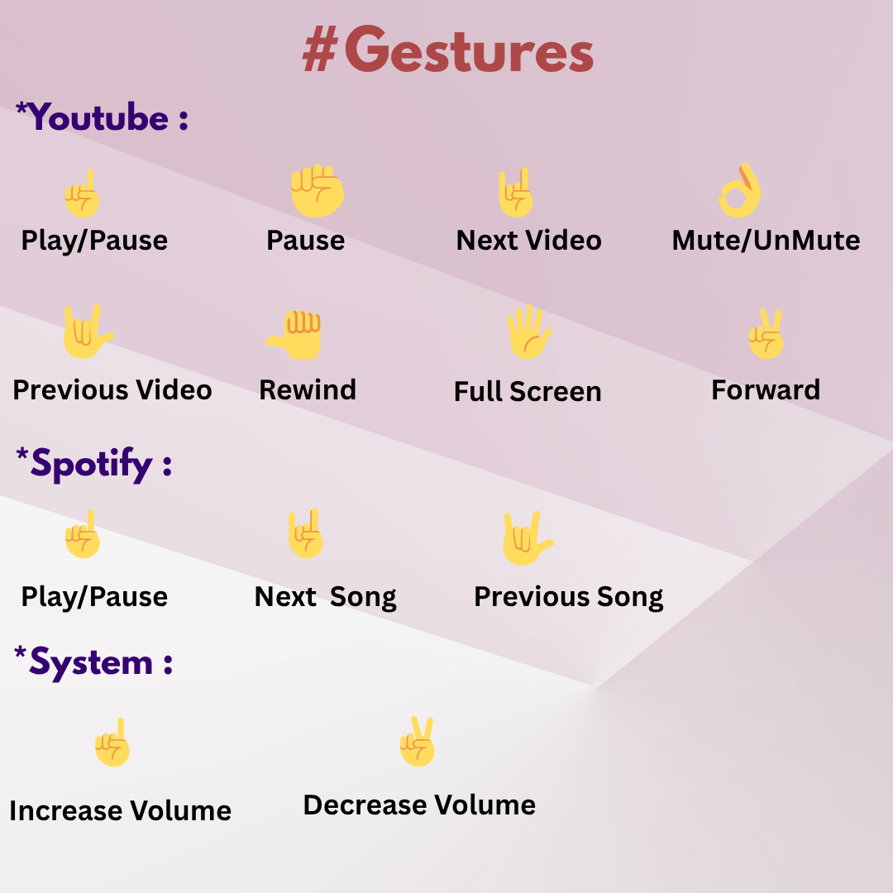

# Zesture - Gesture Media Controller 

A Python-based project that lets you control YouTube, Spotify, and system media functions like sound control using **hand gestures** detected through your webcam. Built using **OpenCV**, **MediaPipe**, and **PyAutoGUI**.

<br/>


##  Features

- 👋 Real-time hand tracking, webcam using **MediaPipe**, **OpenCV**, **PyAutoGUI** 
- 🖐️ Finger gesture detection (e.g., Play/Pause, Next, Mute, Fullscreen)
- 🎬 Control **YouTube** (Play, Pause, Mute, Rewind, Forward, Fullscreen, Next video, Previous Video)
- 🎵 Control **Spotify Web Player**(Next Song, Previous Song, Play, Pause)
- 💻 Control **System Media** (Volume Up/Down)
- 🪟 Auto splitscreen layout: webcam left, browser right
- 🪟 Always-on-top OpenCV live feed window
- ⌨️ Mode switch using keyboard keys:
  - `y` → YouTube Mode
  - `s` → Spotify Mode
  - `t` → System Mode
- 📄 Action logging supported

<br/>


##  Example Gestures for YouTube

| Gesture           | Fingers          | Action                 |
|-------------------|------------------|------------------------|
| One Finger Up     | `[0,1,0,0,0]`    | Play / Pause           |
| Thumb Only        | `[1,0,0,0,0]`    | Rewind 10s             |
| Two Fingers Up    | `[0,1,1,0,0]`    | Forward 10s            |
| All Fingers       | `[1,1,1,1,1]`    | Fullscreen             |
| Closed Fist       | `[0,0,0,0,0]`    | Pause                  |
| Pinky Only        | `[0,0,1,1,1]`    | Next Video             |

> Gesture configurations can be customized in `core/gesture_manager.py`.
> More Gestures are configured in `controllers` module.

<br/>


##  Project Structure

```bash
Zesture/
│
├── main.py                  # Main app entry point
├── README.md
├── requirements.txt
│
├── config/
│   └── gesture_config.py    # Config settings (window size, cooldowns)
│
├── core/
│   ├── gesture_manager.py   # Routes gestures to correct media handler
│   └── mode_manager.py      # Tracks and updates current mode
│
├── controllers/
│   ├── youtube_controller.py  # Gesture actions for YouTube
│   ├── spotify_controller.py  # Gesture actions for Spotify
│   └── system_controller.py   # Gesture actions for system media
│
├── detectors/
│   └── gesture_detector.py  # MediaPipe-based hand tracker
│
├── logs/
│   └── gesture_log.py       # Gesture logging
│
└── utils/
    ├── gestures.png         # Gestures List
    ├── always_on_top.py     # Makes OpenCV window topmost
    └── window_utils.py      # Snaps browser to right, video to left
```


```md
##  Requirements

Install required packages:

```bash
pip install opencv-python mediapipe pyautogui pygetwindow
Note: On Windows, make sure your webcam and hotkey permissions are enabled.

<br/>


> How to Run

python main.py
Press i -> For Displaying Instructions

Press r -> For Showing Gestures

Press y -> Opens YouTube and enters YouTube Gesture Mode (You can add your customised youtube video link in the code)

Press s -> Opens Spotify Web Player and enters Spotify Mode (You can add your customised spotify playlist link in the code)

Press t -> Switch to System Media Control Mode

Press d -> Exit the program

Your webcam feed appears on the left, and your browser auto-snaps to the right.

<br/>


> Gesture Reference Image

Here’s a quick reference of supported gestures:



> Demo Video 

[Watch Demo on Google Drive](https://drive.google.com/file/d/1ZA_4sNiLsikWPe3xjwKZMs_sar5VWTu7/view?usp=sharing)

<br/>


> Use Case Ideas

Contactless - Perfect for hands-free control during workouts or cooking, allowing users to interact with media without touching devices.

Accessibility - solution for users with mobility issues

Enhance - smart desktops or embedded vision systems

<br/>


> Inspiration

This project showcases how computer vision and gesture recognition can build hands-free control systems, blending machine perception with real-world interaction.

<br/>


> Author

Tejasree Dasoju  
GitHub: @Tejasree731